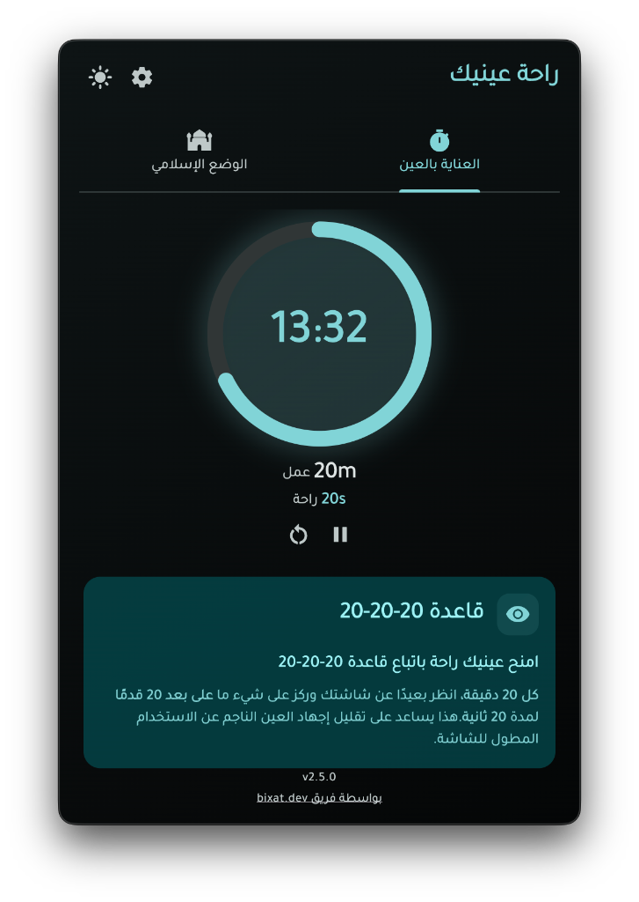
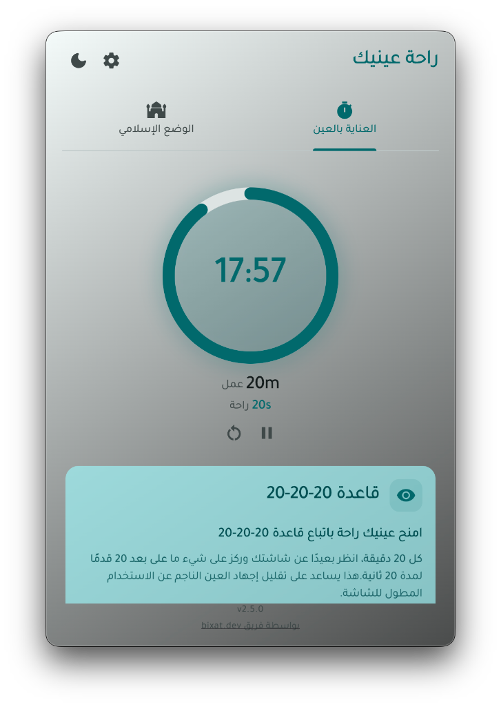
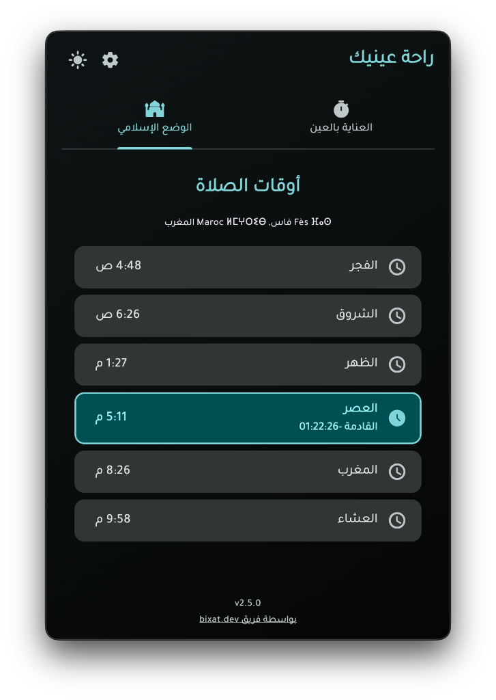
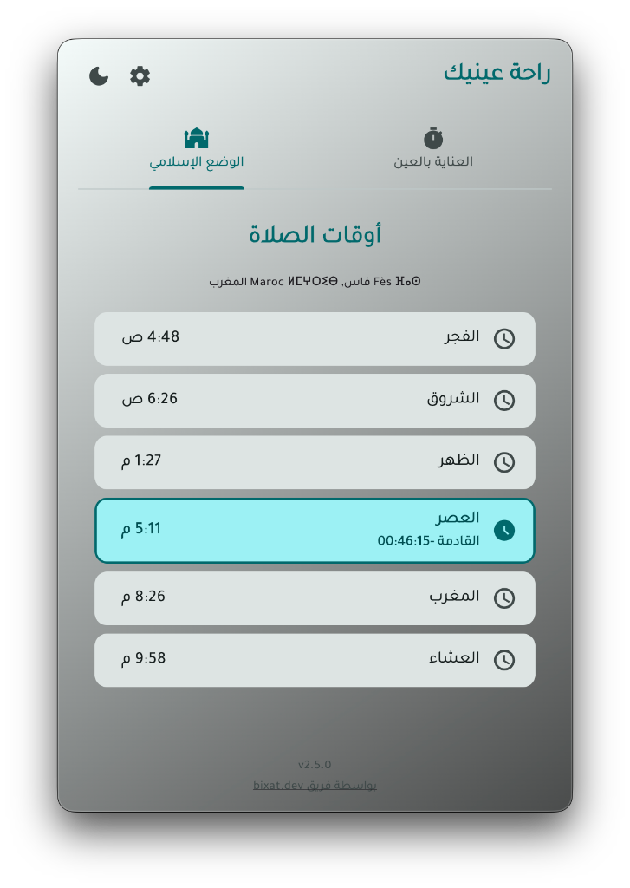
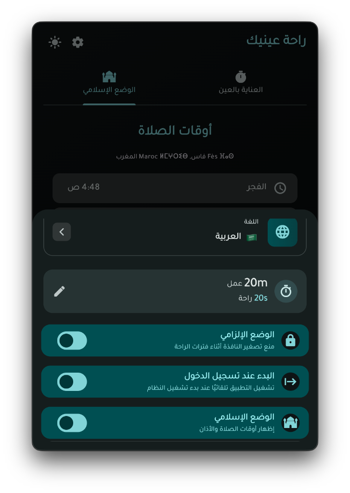
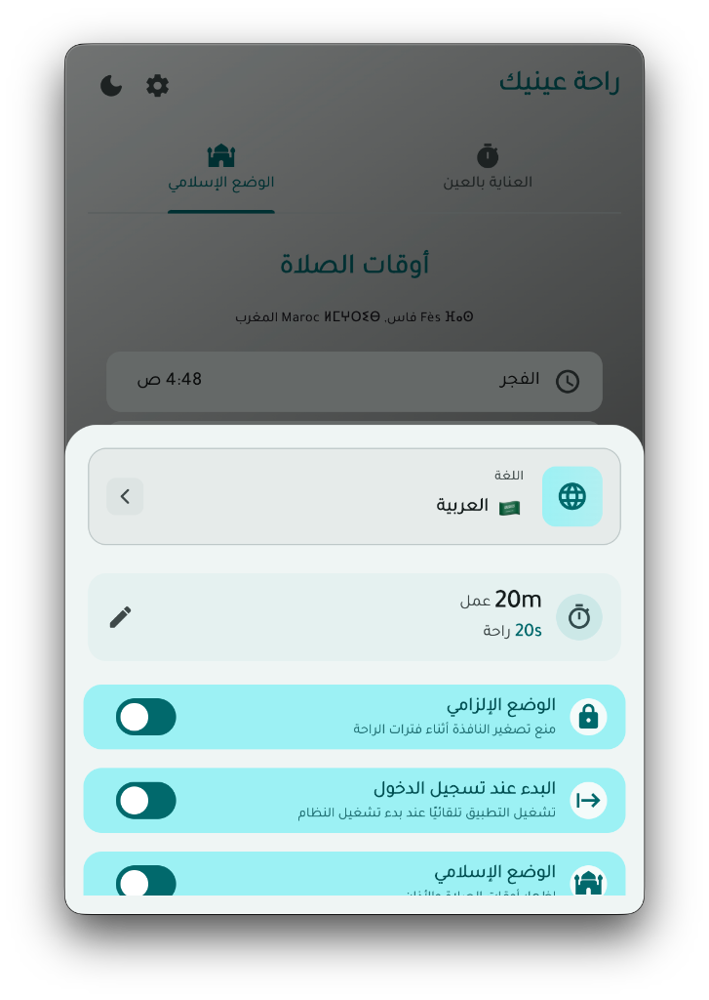
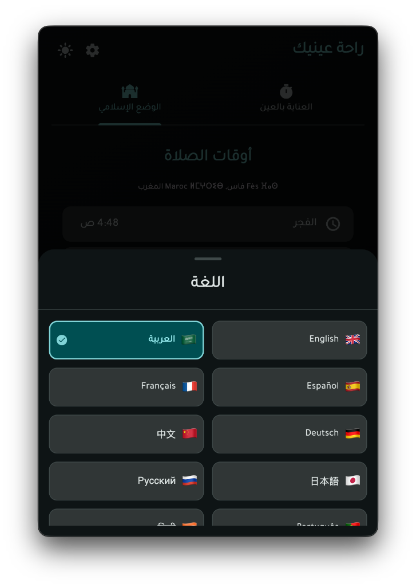
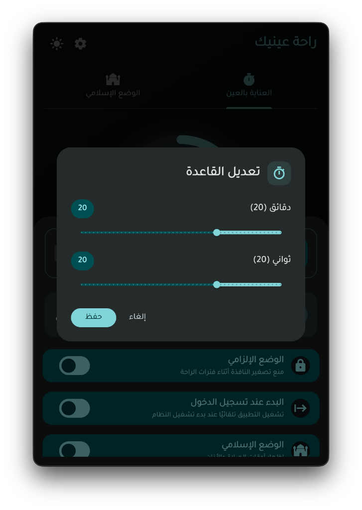
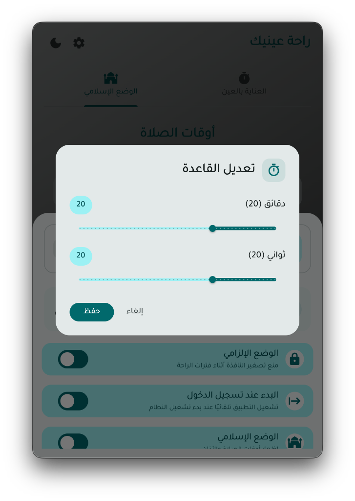

# Taline Desktop App

Taline is a desktop application built with Flutter, designed to help users maintain healthy eyes by following the 20-20-20 rule. The app reminds users to take regular breaks and rest their eyes to reduce eye strain and prevent digital eye fatigue.

## Screenshots

  
  

  
  

  
  

  

  
  

## Support

## Table of Contents

- [Features](#features)
- [Installation](#installation)
- [Usage](#usage)
- [Contributing](#contributing)
- [License](#license)

## Features

- **Customizable Reminder:** Set personalized reminders to take breaks and rest your eyes based on your preferences, with options to follow the 20-20-20 rule or a custom time interval.
- **Countdown Timer:** Monitor the time remaining until your next scheduled eye break, with a fully adjustable countdown timer feature to suit your needs.
- **Notifications:** Get customizable desktop notifications or alerts to remind you when it's time for your next eye break with options for forcing take break mode.
- **Muslim Mode:** A dedicated mode for Muslim users that displays accurate prayer times, plays Azan notifications, and helps balance screen time with prayer schedules. Includes access to educational resources about Islam.
- **Multi-language Support:** Available in multiple languages including English, Arabic, Spanish, French, German, Portuguese, Russian, Chinese, Japanese, Hindi, and Turkish.
- **Startup at Login:** Control whether Taline launches automatically when you log in to your computer.

## Coming soon

- **Eye Exercises:** Access a collection of eye exercises and follow along to relax and strengthen your eye muscles.
- **Usage Statistics:** View detailed statistics on your app usage and monitor your progress in following the 20-20-20 rule.

## Installation

1. Clone the repository: `git clone https://github.com/bixat/taline.git`
2. Navigate to the project directory: `cd taline`
3. Install the dependencies: `flutter pub get`
4. Run the app: `flutter run`

## Usage

1. Launch the Taline app on your desktop.
2. Start using the app, and it will notify you when it's time to take a break.
4. During each break, follow the 20-20-20 rule by looking at an object 20 feet away for 20 seconds.

## Contributing

We welcome contributions from the community to enhance the Taline app. To contribute, please follow these steps:

1. Fork the repository.
2. Create a new branch: `git checkout -b feature/your-feature-name`
3. Make your changes and commit them: `git commit -m 'Add feature'`
4. Push to the branch: `git push origin feature/your-feature-name`
5. Submit a pull request.

## License

[MIT License](/LICENSE)

## Tools / Acknowledgements

- [rocket_timer](https://pub.dev/packages/rocket_timer)

Special thanks to these amazing projects from [LeanFlutter](https://github.com/leanflutter) which help power Taline:

- [local_notifier](https://pub.dev/packages/local_notifier)
- [window_manager](https://pub.dev/packages/window_manager)

## Support

If you encounter any issues or have any questions or suggestions, please [open an issue](https://github.com/bixat/taline/issues) on the GitHub repository.

---
